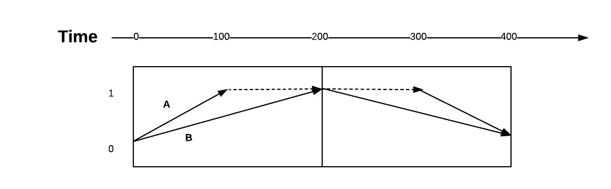
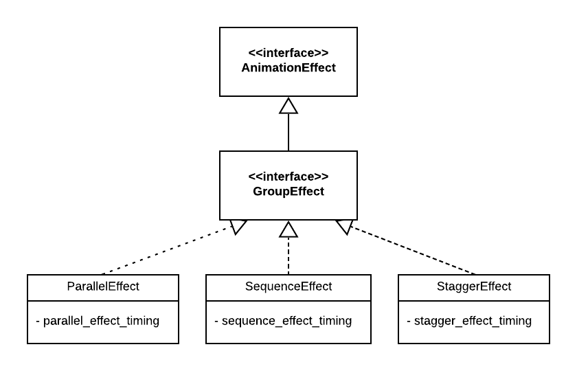
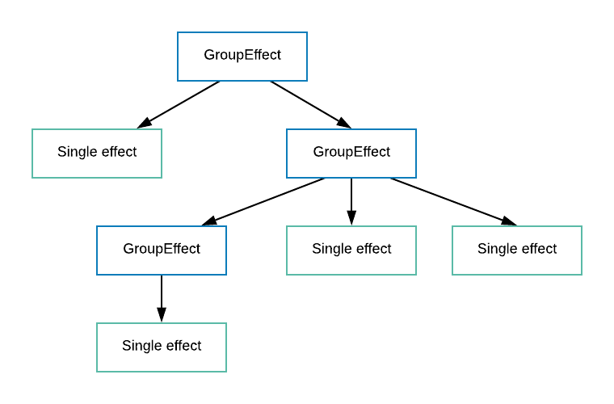

# Group Effects Explainer

## Introduction
Animation sequencing is a common technique that allows creation of complex animated effects where multiple effects (potentially on multiple targets) are animated together as a group.

There is currently a draft proposal to include some form of sequencing in [Web Animations Level 2 Specification](https://drafts.csswg.org/web-animations-2/#group-effect). The proposal introduces a `GroupEffect` which is a type of `AnimationEffect` that contains an ordered sequence of other animation effects a.k.a children effects.

In the explainer we are proposing a few changes to this model with the objective to introduce flexibility and customizability. Furthermore we propose adding a new sequencing model “stagger”.  The altered design introduces a different hierarchy of group effects: An abstract group effect representing the grouping, and concrete sub-types that define different possible mapping of time from the parent to children.

## Motivations
Grouping is a powerful mechanism that allows creation of complex tree structures by hiding the complexity inside the group. Note that for this to work well the group should hide its inner working and expose a common API. This is a valuable primitive that allows scaling animations to complex sequences and it is a common technique supported by popular animation [libraries and tools](#Appendix).

### Why adding this to web animations
With current level-1 web animations specification, to create a coordinated sequence of animations a web developer has to create multiple animations and each of them is associated with only one effect and target.

This can work but suboptimal for the following reasons.
* Ergonomics:
  * Developer has to manually compute and maintain timing of various sub-animations.
    * The dependency between effects (e.g., B starts after A or in the middle of it) has to be manually maintained. For example changing the duration of A needs to change the start time of B which needs recalculation and it can be extremely complex in certain cases. It is is easier for browser to maintain and auto update them.
  * No common playback controls for group i.e., each animation must be played/cancelled individually which means more tracking on the web developers part.
  * It is not easy to synchronize the starting of the animation since play is asynchronous.
  * With group effects one can create complex iterated animations  (using features such as “playback-direction: alternative” etc.) that involve multiple elements. These are difficult to do correctly without `GroupEffect`.
* Efficiency: Maintaining a list of animations is costly. Further, with GroupEffect browsers can take a whole tree of effects and turn it into a more closed form that is efficient.

#### Example
Consider this sequence where two elements are animated and then reversed.

A possible implementation without grouping can be done this way:

```
// Without GroupEffect
var effect_a = new KeyframeEffect(
    target_a, [{ opacity: 0, offset: 0},
               { opacity: 1, offset: 0.5},
               { opacity: 1, offset: 1}], {
    duration: 200, iterations: 2, direction: 'alternate'});

var effect_b = new KeyframeEffect(
    target_b, { opacity: [0, 1] }, {
    duration: 200, iterations: 2, direction: 'alternate' });

var animation_a = new Animation(effect_a, document.timeline);
var animation_b = new Animation(effect_b, document.timeline);
animation_a.play();
animation_b.play();
```

There are several drawbacks in the example above:
* Extra effort regarding setting the keyframe offset of effect\_a to create desired effect.
* effect\_a is better described as a 100ms effect with two keyframes and fill: ‘forwards’ but now has to be an effect with duration 200ms with three keyframes.
* When it comes to multiple effects, developers have to coordinate all the effects with multiple animations manually.
* There are also two animations that need to be played and cancelled if needed.

With grouping the code can be described more naturally as:
```
// With GroupEffect the effects don't need to have exact durations.
var effect_a = new KeyframeEffect(
    target_a, { opacity: [0, 1] }, {duration: 100, fill: 'forwards' });

var effect_b = new KeyframeEffect(
    target_b, { opacity: [0, 1] }, {duration: 200});

// The API is non-normative.
var parallel_effect = new ParallelEffect([effect_a, effect_b],
    {iterations: 2, direction: 'alternate'});

var animation = new Animation(parallel_effect, document.timeline);
animation.play()
```

### Deviation from existing design in Level-2
The key insight of the [current design](https://drafts.csswg.org/web-animations-2/#group-effect) is to allow grouping of the animation effects. We believe this is the right choice but propose some changes in the hierarchy of classes.

In the current design the base class (`GroupEffect`) comes with a default time mapping from the group time to the child. This default choice is parallel. i.e. children have the same `start time` as the group. Then there is a special group effect: `sequence effects` which overrides the time mapping to arranges the start time of the children effects in a way that they start in turn.

We propose to separate the concepts of “group of effects” from “time mapping” thus making it more natural to later add grouping with custom time mappings. In this design the base class, `GroupEffect`, has no time mapping and cannot be directly constructed. Instead, concrete subclasses (`SequenceEffect`, `ParallelEffect`, `StaggerEffect`) have time mappings. In particular, in future [AnimationWorklet](https://drafts.css-houdini.org/css-animationworklet/) can be used to allow a special WorkletGroupEffect whose time can be mapped to its children in any fashion.

Also, the existing spec only speculates two different scheduling models (i.e. parallel, sequence) and we believe stagger is a nice addition . See [example](#Appendix) of stagger in popular frameworks.

## Proposed Design


`GroupEffect`: an abstract class that contains an ordered list of “child effects” but not time mapping from parent to children and not intrinsic iteration duration. There are some concrete subclasses which have a specific time mapping model. These models determine
 1. the intrinsic iteration duration of the group
 1. how group inherited time maps to a child inherited time.

Note that the basic supported types map have a simple time shift model which addresses most common use cases.
* ParallelEffect:
  * Mapping: No shift, all children start at the same time.
  * Intrinsic duration: Max duration of children
* SequenceEffect:
  * Mapping: each child starts after another (note that ordering is important)
  * Intrinsic duration: Sum duration of children
* StaggerEffect:
  * Mapping: each child starts after a constant time depending on its rank
  * Intrinsic duration: Max (stagger_delay * i + duration of child(i))

Notes:
* Since a child time is determined by its parent. It is not allowed to set the localTime of a child directly.
* This model is more expandable and more interesting grouping mechanisms can be introduced in the future. e.g. this is usable in `AnimationWorklet` to allow creation of interesting new Groupings.
* Does not allow cycles, i.e., a group effect cannot be its own descendent.

* The children are contained inside the parent.
* Since individual animation effects have mutable timings (AnimationEffect.duration) then the group effect timings are mutable as well.


## Design Constraints
* We should be able to use this inside `AnimationWorklet` where we allow animation worklet to create custom sequencing models.
* `GroupEffect` is a “compositing mechanism” thus it should have a common interface between group nodes and the leaf node (i.e., `AnimationEffect`)
* Should the group-start delay be immutable? What if we change the timing model of children in the group (e.g., increase the duration) will that cause the local time of the subsequence effects to change.
* What’s our answer to the current timing functions [issues](https://drafts.csswg.org/web-animations-2/#issues-index)?
  * Issue 4: overflow
  * Issue 5: non-linear

## Examples

An example of using GroupEffect to animate two correlated effects with AnimationWorklet.


```
// Inside AnimationWorkletGlobalScope.
registerAnimator("test_animator", class {
    constructor(options, state = { hold_time : 0 }) {
      this.hold_time = state.hold_time;
    }
    animate(currentTime, effect) { 
      let effects = effect.getChildren();
      if (currentTime <= effects[0].getTiming().duration * 0.3) {
        effects[0].localTime = currentTime;
        effects[1].localTime = 0;
        this.hold_time = effects[0].localTime;
      } else if (currentTime <= effects[0].getTiming().duration * 0.6) {
        effects[0].localTime = this.hold_time;
        effects[1].localTime = currentTime - this.hold_time;
      } else {
        effects[0].localTime = currentTime - this.hold_time;
        effects[1].localTime = currentTime - this.hold_time;
      }
    }
    state() {
      return {
        hold_time : this.hold_time
      };
    }
});

// In document scope.
let effect_a = new KeyframeEffect(
    target,
    [{ height: '100px' }, { height: '200px' }],
    { duration: 2000 }
);

let effect_b = new KeyframeEffect(
    target,
    [{width: '100px' }, {width: '200px' }],
    { duration: 2000 }
);

// The API is non-normative.
var exclusive_effect = new ParallelEffect([effect_a, effect_b], {fill: 'forwards'});

let animation = new WorkletAnimation('test_animator', exclusive_effect);
animation.play();
```

## Appendix
### Relevant information and use cases
* Multi-step animations: when there is a need for a series of animations occur one after another: https://css-tricks.com/using-multi-step-animations-transitions/
  * Note that sequencing can be done today but it is not easy to update timings etc. New API can help here.
  * Material design discussion of animation choreography: https://material.io/design/motion/choreography.html

* Staggering: a common technique to start a series of animations (often the same animations) each after a delay.  See https://codepen.io/sdras/pen/9c852940ec52897ca79544879de90eab
  * You can do this with multiple animations with different delays or if you have a sequence group. But maybe we can have a StaggerGroup.
  * See this GSOCK example: https://greensock.com/docs/TimelineMax/staggerFrom()
  * Angular also supports (group, sequence, stagger): https://angular.io/guide/complex-animation-sequences
* SMIL has: par/seq/excl groupings for animations: https://www.w3.org/TR/REC-smil/smil-timing.html#Timing-ParSyntax
